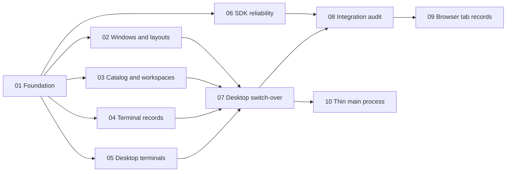

# Daemon authority: one flat model, a presentation-only client, real terminals

Status: open
Type: wayfinder map
Label: wayfinder:map

Planned 2026-09-29. This map plans; it does not build until its tickets are started.

## Goal

ADE is fully driveable without the desktop. The CLI, the SDK or another team's UI can do
everything the desktop does, because every durable record, every rule and every multi-step
operation lives in the profile daemon. The desktop draws the daemon's state and turns gestures
into daemon commands.

Three pieces of work get there, run in parallel lanes:

1. **One flat model.** Every record is stored flat by ID with exactly one owning parent. Every
   other relationship is a typed reference. Trees (the navigator, a window's panes, a
   Conversation's children) are views computed from the records, never stored nested.
2. **Logic moves to the daemon.** Windows, layouts, panes and tabs; worktree create and delete;
   attention state; review prompts; settings. Client-side reliability (journals, retries)
   moves from Electron main into the SDK, so every client gets it.
3. **Real terminals.** Tabs name the terminal they show; the daemon lists terminals as records
   with status and a busy flag; closing a terminal tab stops it, asking first when busy.

## Decisions so far

The user decided (2026-09-29):

- Option B: flat records, one owner each, typed links.
- The daemon owns windows and layouts. The desktop is a presentation layer.
- Any number of lanes and tokens; the coordinator picks the approach.

The coordinator decided (2026-09-29), each recorded as D18 in
[the decision register](../ade-v1/decisions.md) by [ticket 01](issues/01-phase-0-foundation.md):

| # | Decision | Why |
|---|---|---|
| 1 | The daemon applies every layout change; the desktop keeps no layout reducer | One implementation; a local socket round trip is well inside a frame. Gestures (drag preview, live resize) stay local and commit when they end. Fallback, only if [ticket 07](issues/07-desktop-switch-over.md) measures a drop-to-paint p95 above 16 ms: optimistic local apply checked by shared test vectors |
| 2 | Layout changes are one idempotent command, `layout.apply`, carrying a typed action | Mirrors today's `LayoutAction`; callers supply every new ID, so a retry is harmless. An optional `expected_revision` refuses a stale write |
| 3 | Plain folders are projects too; `workspace.project_id` is never null | One tree shape: every workspace has a project |
| 4 | One project ID for the catalog and the worktree lifecycle | Today `repo_…` and `repository_…` name the same repository |
| 5 | Closing a tab follows its target: a terminal tab closes the terminal (refused with `terminal_busy` unless confirmed); a conversation, file, diff or browser tab only leaves the layout | The daemon owns the rule, so the CLI behaves the same |
| 6 | Per-window view state (collapsed projects, recent workspaces) is stored with the window, and which pane is focused with the layout; keyboard focus inside a pane, scroll, hover and drag state stay local | A second UI attached to the window sees the same tree; transient state needs no round trip |
| 7 | Appearance, motion, typography and keybindings are profile settings in the daemon; Electron main keeps only a startup copy for the first paint | Preferences are durable state |
| 8 | A child Conversation is listed under the workspace it runs in, with a link to its parent; the parent lists its children | Ownership stays single; the link carries the relationship |
| 9 | Layouts saved in localStorage are imported once into the daemon, then the local copy is deleted | Keeps the author's layouts through the switch |
| 10 | Browser tab records move later ([ticket 09](issues/09-browser-tab-records.md)) | Largest and least urgent; it needs windows first |
| 11 | Lanes work in their own worktrees; the coordinator rebases each finished step onto `main` and fast-forwards | Each lane keeps a working gate; `main` stays linear. The user approved parallel work in any form on 2026-09-29 |

## The model

Every record below is owned by one profile daemon. **Owner** is the single parent; deleting or
removing the owner decides what happens to the record. **Links** are references that do not own.

| Record | Owner | Key fields | Links |
|---|---|---|---|
| Project | Profile | `id`, `kind` (`repository` or `folder`), `name`, `root` (Git common directory, or the folder) | — |
| Workspace | Project | `id`, `project_id`, `root`, `name`, `kind` (`primary_checkout`, `linked_worktree`, `folder`), `branch` (HEAD branch or null), `default` (the daemon's own workspace), `ade_owned` (ADE made the worktree and may delete it) | — |
| Conversation | Workspace | `id`, `workspace_id`, `title`, `provider`, `status`, `attention` (`idle`, `running`, `needs_you`, `error`), `unread` | `parent_conversation_id`, `group_id` (orchestration) |
| Terminal | Workspace | `id`, `workspace_id`, `kind` (`shell`, `service`, `script`), `title`, `status` (`running`, `exited` with code, `stopped`), `busy` (a foreground process other than the shell), `primary` (the workspace's first shell) | `service_id` or `script_run_id` when it has one |
| Service, script run | Workspace | as today | `terminal_id` |
| Window | Profile | `id`, `workspace_id` (shown now), `bounds`, `state` (`open`, `closed`), view state (collapsed projects, recent workspaces) | — |
| Layout | Window + workspace | `window_id`, `workspace_id`, `revision`, sidebars (sides, collapsed, widths), pane tree, `focused_pane`, `maximized` | — |
| Pane, split | Layout | as today's `PaneNode` and `SplitNode` | — |
| Tab | Layout | `id`, `target` | `target`: `{kind: conversation, id}`, `{kind: terminal, id}`, `{kind: browser, id}`, `{kind: file, path}`, `{kind: diff, path, staged}`, `{kind: new_conversation}` |

- **Branch** is an attribute of a workspace, not a record: Git allows one worktree per branch,
  and branches without a worktree are not ADE's concern. The daemon refreshes it on open, after
  its own Git operations, and when the checkout's `HEAD` file changes.
- **Worktree** is a workspace whose `kind` is `linked_worktree`. The lifecycle keeps its own
  operation ledger, keyed by the same project ID.
- A tab's title is derived from its target (the conversation's title, the terminal's title),
  so renaming anything renames its tabs everywhere.

### Decisions from the tickets

- 01: migration numbers are assigned by the coordinator at merge; lanes write named migration
  functions under a provisional `if version < 18`.
- Frontend review (2026-09-29): `review.feedback.send` also owns the stale-anchor checks (lane B);
  every layout action that drops a shell terminal's tab closes the terminal, refusing when busy
  (lane A); main's duplicate request checks, selection and fixed keybindings move out (ticket 10).
- Lane A review (2026-09-29): `layout.apply` and `layout.replace` stay idempotent and never end a
  process. Closing a tab or pane that holds a running shell's last tab (counted across every
  window) is the effect commands `tab.close` and `pane.close`, with a receipt; `layout.apply`
  refuses such a change with `tab_close_required`. Toggle actions carry their target state so every
  layout action is safe to repeat.

## Who owns what

| Layer | Owns | Must not own |
|---|---|---|
| Daemon | Every record above; every rule a second client would need to repeat; every multi-step operation | Pixels, gestures, platform APIs |
| SDK (`packages/client`) | Commands, the feed, projection application, and client-side reliability: journals of requests the daemon has not admitted, retries under the same operation ID, refusal proofs | UI framework, Electron |
| Electron main | Native windows for the daemon's window records, menus, notifications, crash recovery, and hosting browser pages as the registered browser owner | Durable records, layouts, orchestration of daemon calls |
| Renderer | Drawing, gestures, animation, local performance policy (`keepMounted`, `keepTerminals`), room and fit rules, wording | Durable state, business rules |

The test for new work: if the CLI or another UI would have to repeat it to behave the same, it
belongs in the daemon (or, for delivery reliability, the SDK).

## What moves, and where

| From | To | Ticket |
|---|---|---|
| Renderer `layout-store`, `layout.logic`, `layout-tree` and their localStorage; main's `selectedWorkspaces` | Daemon windows and layouts (`window.*`, `layout.*`) | [02](issues/02-lane-windows-layouts.md), [07](issues/07-desktop-switch-over.md) |
| Main `workspace-actions.ts` (4–5 chained calls and a 15-minute poll) | `workspace.create_worktree`, `workspace.delete_worktree` effect commands | [03](issues/03-lane-catalog-workspaces.md) |
| Renderer `conversationState` | Conversation `attention` and `unread` | [03](issues/03-lane-catalog-workspaces.md) |
| Main `reviewPromptText`, `reviewBatchPrompt` | `review.feedback.send` builds and queues the prompt | [03](issues/03-lane-catalog-workspaces.md) |
| Renderer theme and motion preference; main's appearance copy | `settings.get`, `settings.set` | [03](issues/03-lane-catalog-workspaces.md) |
| Navigator collapsed state in localStorage; layout store `recent` | Window view state | [02](issues/02-lane-windows-layouts.md) |
| Main `send-journal`, `git-journal`, `git-refusal`, their outbox wiring | SDK | [06](issues/06-lane-sdk-reliability.md) |
| Main `browser.ts` tab list and receipts | Daemon browser tab records; Electron stays the owner that renders | [09](issues/09-browser-tab-records.md), later |

Stays in the desktop: drag and drop, room and fit rules, window minimum size, Motion, the
Ghostty renderer, `keepMounted` and `keepTerminals`, blocker wording, native menus and
notifications, browser pages with their automation, capture and recording.

## Lanes

| Lane | Ticket | Worker | Owns (files) | Blocked by |
|---|---|---|---|---|
| Foundation | [01](issues/01-phase-0-foundation.md) | Coordinator, serial | Decisions, architecture doc, CONTEXT.md, contract domain registration, `TabTarget` contract, worktrees | none |
| A. Windows and layouts | [02](issues/02-lane-windows-layouts.md) | Backend agent | `contract/layout.rs`, `ade-core` layout core, daemon window and layout store and handlers, CLI `window` and `layout`, `e2e/protocol/layouts/` | 01 |
| B. Catalog and workspaces | [03](issues/03-lane-catalog-workspaces.md) | Backend agent | `contract/workspaces.rs`, `worktrees.rs`, `review.rs`, `settings.rs`, conversation attention fields, `e2e/protocol/workspaces/` | 01 |
| C. Terminal records | [04](issues/04-lane-terminal-records.md) | Backend agent | `contract/terminals.rs`, daemon terminal records, runtime busy detection, `e2e/protocol/terminals3/` | 01 |
| D. Desktop terminals | [05](issues/05-desktop-terminals.md) | Coordinator | `apps/desktop` terminal tabs, stream bridge, terminal content | 01 |
| E. SDK reliability | [06](issues/06-lane-sdk-reliability.md) | Backend agent | `packages/client` journals; `apps/desktop/src/main` journal files and `conversations/` | 01 |
| Switch-over | [07](issues/07-desktop-switch-over.md) | Coordinator | `apps/desktop` onto lanes A–C | 02, 03, 04, 05 |
| Integration | [08](issues/08-integration-audit.md) | Coordinator and a read-only reviewer | Whole tree | 06, 07 |
| Browser tab records | [09](issues/09-browser-tab-records.md) | Later | — | 08 |
| Thin main process | [10](issues/10-thin-main-process.md) | Coordinator | `apps/desktop/src/main` request checks, selection, keybindings | 07 |
| Electron memory floor | [11](issues/11-electron-memory-floor.md) | Coordinator | desktop idle memory | 08 |

Lane D does not wait for lane A: it adds the `target` field to today's local layout store from
the `TabTarget` contract fixed in ticket 01, and ticket 07 moves the same field to the daemon.

## Coordination protocol

This reuses what worked in the [parallel build](../parallel-build/issues/13-coordination-protocol.md).

- **Trees.** The coordinator cuts one worktree per backend lane with `wt` before starting it,
  and retires it with `wt remove` after merging. At most five trees; E2E runs with
  `ADE_E2E_WORKERS=2`. A worker's first step: fast-forward to `main`, `pnpm install`, clone
  `.ade/native`, `.ade/vendor` and `.ade/tools` from the main checkout.
- **Shared files.** Only the coordinator edits the contract `DOMAINS` list, migration
  numbering, `AGENTS.md`, `CONTEXT.md`, the decision register, `progress.md`, the requirements
  register and `THIRD-PARTY-NOTICES.md`. Ticket 01 pre-registers every new domain, so lanes never
  touch that list. Lanes write migrations as named functions under a provisional number; the
  coordinator assigns the final schema version at merge time.
- **Contracts.** Each lane edits only its own contract files and runs `pnpm contract:generate`.
  On a merge conflict in `packages/contracts`, regenerate rather than hand-merge.
- **Gate.** Each finished step passes `pnpm check:static` in its tree, plus the lane's protocol
  E2E. One read-only review agent checks each lane before merge.
- **Merge.** The coordinator merges one lane step at a time: rebase onto `main`, full static
  checks and build, fast-forward. A red result goes back to the lane.
- **Evidence.** Each lane writes `.scratch/ade-v1/evidence/<lane>.md` with its E2E results and
  time log; the coordinator folds it into `progress.md` and reports cost after each round.
- **Stray processes.** After each lane, check `pgrep -fl ade-daemon` and `ade-runtime` for
  leftovers from E2E and stop them.

## Rounds

| Round | Runs in parallel | Ends when |
|---|---|---|
| 0 | Ticket 01 (coordinator alone) | Decisions recorded, domains registered, `TabTarget` contract generated, trees cut |
| 1 | Tickets 02, 03, 04, 06 (agents) and 05 (coordinator) | Each lane merged with its E2E green |
| 2 | Ticket 07 (coordinator), with 03 and 04 follow-ups that need layouts (tab removal on terminal close) | The desktop keeps no durable state of its own; the dev app works end to end |
| 3 | Ticket 08 | Integration audit clean, benchmark re-run, CLI-only acceptance passes |

## Acceptance for the whole effort

- A protocol E2E drives a window purely through the CLI: create a workspace worktree, open a
  window on it, split a pane, open a terminal tab, run a command in it, close the tab while the
  command runs (refused as busy), confirm, and read the resulting layout.
- The desktop shows the result of that CLI run without a restart, and its own gestures appear in
  `ade layout get`.
- `apps/desktop` holds no durable state except the startup appearance copy and the
  not-yet-admitted journals the SDK stores through it.
- The four-workspace benchmark (4 conversations and 6 real terminals each) holds 60 fps on
  workspace switch and memory within 10% of the last measurement (about 411 MB).

## Not decided yet

- The shape of a second attached UI (F004 simultaneous clients) is designed for, not built:
  layouts carry a revision and the feed broadcasts changes, but no second client ships here.
- Detached and floating views (F012) will need a window per detached pane; the window model
  allows it and no ticket builds it.
