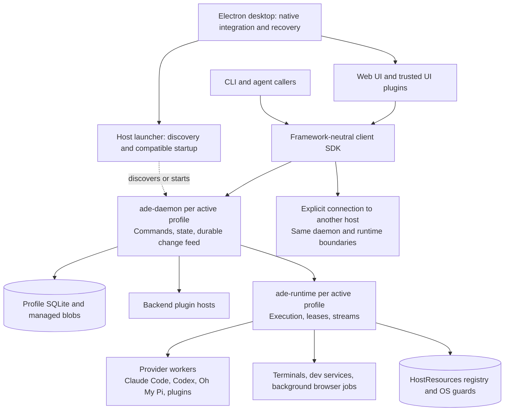

# Proposed ADE architecture

Status: design proposal, 26 September 2026. This document records the proposed
successor to the prototype at `e42e5e7`; it does not describe implemented behavior.
[Architecture and contribution map](architecture.md) describes the current code.
The existing implementation task list is not the build plan for this proposal.
The [v1 specification index](../.scratch/ade-v1/README.md) is the item-level scope
and E2E acceptance reference; it preserves all 140 original catalogue dispositions.
The [monorepo initialization plan](monorepo-initialization-plan.md) records the
subsequent React, xterm.js and Fallow selections and the end-to-end-only test policy.

The proposal keeps Rust for durable state and process supervision, replaces the
GPUI frontend with an Electron desktop application, and makes the same application
capabilities available through the UI, CLI, SDK, and installed plugins. The first
usable milestone is a local macOS application that its author can develop inside.

The audit supports these boundaries, but it does not establish that ADE outperforms
Orca, Paseo, t3code, or OpenCode. Their source snapshots provide design evidence;
performance, recovery, and provider compatibility still require implementation
and measurement. No application code changes are part of this proposal.

## 1. System shape



The diagram describes ownership, not one transport per arrow. Ordinary browser
tabs belong to Electron and remain separate from the application renderer.
Background browser jobs require an explicitly created runtime-owned browser.

Only active profiles start processes. A profile can remain active without an open
window while it owns work. A small host launcher discovers and starts compatible
processes; it does not own conversations, application state, or scheduling.

### Process and module responsibilities

| Boundary | Owns | Must not own |
|---|---|---|
| Electron main | Native windows for the daemon's window records, native menus, notifications, browser surfaces, fresh-renderer recovery | Authoritative conversations, layouts or provider lifecycle; chains of daemon calls that another client would repeat |
| UI renderer | Rendering, gestures, transient interaction state, trusted UI extensions | Durable state, layouts, business rules, direct database access or implicit execution ownership |
| Client SDK | Commands, queries, projection application, reconnect and cursor consistency | Electron, UI framework, backend implementation, provider SDK dependencies |
| `ade-daemon` | Profile state including windows, layouts, panes and tabs; command admission, operation journal, change feed, orchestration policy | Provider processes whose lifetime depends on its connection |
| `ade-runtime` | Actual execution, provider workers, PTYs, service processes, resource claims | The core application database or presentation state |
| Backend plugin hosts | Restartable extension services and extension computation | Unbounded work inside core transactions |
| Provider workers | Native provider protocol and account execution context | Undocumented privileged application APIs |
| HostResources | Cooperating local runtimes' claims on physical resources | A distributed scheduler or security boundary |

Keep these as deep modules with small interfaces. Each interface must specify
ownership, lifecycle, ordering, cancellation, failures, and compatibility. A
folder per feature or a generic event bus does not establish modularity.

## 2. Product decisions and scope

The desktop is a macOS Electron application. Browser, mobile, and other desktop
platforms are later clients of the same contracts. Rust remains the backend
language. JavaScript and TypeScript dependencies use pnpm. React and xterm.js are
selected for the frontend; Fallow is selected for dead-code analysis. The schema
generator, plugin JavaScript runtime, and concrete transport libraries remain
implementation choices. All new behavioral tests are end-to-end tests; see the
project AGENTS.md and initialization plan.

Profiles have independent identities, accounts, configuration, history, plugins,
and browser data. Multiple profiles may run simultaneously. This is product
separation, not protection against trusted code running as the same OS user.

Installed plugins are trusted code. Agents receive the same application authority
as the user through the common command API. Authentication, attribution, provider
permission semantics, and concurrency rules still apply. The UI is a function of
authoritative application state plus local interaction state.

### Release boundaries

The original feature catalogue contained 140 numbered items. The user's default
was **v1 for every item not deferred or excluded**. The following table preserves
the selection and the dependency corrections agreed during design.

| Disposition | Original catalogue items | Interpretation |
|---|---|---|
| Design now, ship later | 1–4 | Cross-platform desktop, browser client, mobile apps, simultaneous clients |
| Infrastructure in v1 | 5 | Independent headless backend is needed for SSH; a polished standalone server product remains excluded under 130 |
| Design now, ship later | 6 | Offline mobile composition follows the mobile client |
| Design now, ship later | 115, 116 | Push and cross-client notification coordination follow later clients |
| Design now, ship later | 119, 120 | Dictation and conversational voice |
| Design now, ship later | 123 | Relay connectivity; v1 uses direct connections and SSH |
| Not now | 17 | Localization; theme extension support does not implicitly restore it |
| Not now | 44, 45, 47, 48 | Task organization UI, dashboard, automatic settlement, idle hibernation |
| Not now | 72, 76, 77, 79, 80, 84 | Built-in editor, PR workflow, advanced PR review/status, issue trackers, change attribution, saved commands |
| Not now | 108–113 | DAG orchestration, advanced orchestration recovery engine, specialist discovery, schedules, heartbeats, conditional automation |
| Not now | 118, 128, 130 | Ongoing widgets, disposable VM/container environments, polished self-host deployment product |
| Not now | 133–135 | ADE's own MCP server, skill sharing, artifact publishing |
| V1 | All remaining catalogue items | Subject to the capability limits and milestone sequence below |

Core task identity and recovery remain necessary even though task organization UI
and an advanced orchestration engine are excluded. Workspace cleanup remains in
scope; it is distinct from task archive UI. CLI/API access remains in scope even
though exposing ADE itself as an MCP server is excluded.

V1 includes the following feature families:

- Profiles, multiple windows, tabs, splits, detached views, themes, typography,
  motion preferences, keybindings, navigation, accessibility, and replaceable UI.
- Claude Code, Codex, and Oh My Pi; modular provider plugins, generic adapters
  where supported, multiple accounts, readiness checks, model and permission
  capabilities, presets, and provider-reported usage and limits.
- Structured conversations, attachments, context capture, queues, steering,
  recoverable drafts, slash commands, skills, approvals, questions, supported
  rewind and compaction, history import, search, usage views, export, and backup.
- Plugin installation and lifecycle, panels, timeline renderers, composer
  extensions, commands, themes, backend services, hooks, state, and diagnostics.
- Projects and ordinary folders; clone/publish, worktree creation and adoption,
  carrying changes, setup/teardown, ignored-resource handling, checkpoints,
  cleanup, file browsing, previews, diffs, and ordinary Git operations.
- Persistent terminals, programmatic terminal access, managed dev services,
  port visibility, port allocation, stable dev URLs, service wiring, and scripts.
- Embedded browsers, browser profiles and explicit import, context capture,
  automation, diagnostics, recording, computer access, and device integrations.
- Common command API, CLI and SDK; delegation, parallel runs, parent/child
  tracking, messages, waits, questions, desktop notifications, and activity feed.
- Direct remote connections, pairing and revocation, SSH bootstrap, remote
  workspaces, explicit host placement, and capability-based remote previews.
- Central MCP and skill catalogs, resource visibility, retention, diagnostics,
  frontend HMR, plugin development, and conformance/fault tests.

This is a large v1, not a claim that the first milestone contains it all. Additional
bundled providers, forge integrations, device coverage, public dev URL aliases,
and native import fidelity need explicit implementation coverage. A generic
adapter is not a promise that every agent supports every operation.

Unified history means a core-readable view and search with provenance and native
session references. Cross-provider continuation is later: it creates a new native
session with transferred context, not an interchangeable continuation token.
A plugin marketplace is also later; explicit pinned installation comes first.

## 3. Domain identities and ownership

| Entity | Identity and rule |
|---|---|
| Host | Stable execution-host ID; a path is meaningful only on its host |
| Profile | Stable profile ID on a host; owns accounts, settings, history and plugin installations |
| Project | Repository or ordinary-folder registration; not synonymous with a checkout |
| Workspace | Independent stable ID for a checkout/directory on an execution host |
| Conversation | Stable ID bound to workspace, provider session and explicit account context |
| Operation | Stable command ID, canonical payload fingerprint, outcome and reconciliation evidence |
| Execution attempt | Runtime incarnation and attempt/turn generation; distinct from conversation ID |
| Plugin activation | Plugin artifact version plus activation generation; separate from data schema |
| Browser session | Explicit profile, host and frontend/background ownership |
| Window | Stable ID owned by the profile; shows one workspace at a time |
| Layout | One per window and workspace; owns its panes and tabs; carries a revision |
| Tab | Stable ID inside a layout; names what it shows with a tab target (a conversation, terminal, browser tab, file or diff) |
| Terminal | Stable ID owned by a workspace; kind, status and whether a command is running |

A workspace can contain many conversations, terminals, services, and plugin
records. Starting work in the same workspace versus a new worktree is explicit.
Concurrent agents in one checkout can conflict. ADE serializes its own lifecycle
operations; it cannot prevent arbitrary external edits or Git commands.

Names, paths, PIDs, array positions, and active-window selection are not resource
identities. A local profile connects explicitly to remote host/profile identities.
Remote credentials belong to their execution host. Transfer or installation is an
explicit operation, never an incidental side effect of connecting.

Submitted messages are shared application state. Drafts belong to a client and
conversation, with durable recovery and explicit transfer. Windows, layouts, panes,
tabs and per-window view state such as collapsed rows are daemon-owned, so the CLI and
any UI can read and drive what a window shows (decided 2026-09-29, D18). Focus, hover,
scroll position, drag state and pending visual feedback are local interaction state.
Optimistic updates must retain their pending or failed status until authoritative
settlement.

## 4. Commands, execution, and crash recovery

All application operations use versioned commands, queries, and subscriptions.
The desktop, CLI, agents, and plugins enter the same admission path. Native host
features expose explicit availability; a missing frontend-owned browser does not
silently redirect an agent to another window.

Every operation declares one of three tiers in its contract (decided 2026-09-27):

| Tier | Examples | Envelope and durability |
|---|---|---|
| Query | Catalog, snapshots, diffs, file listings | None. Retrying is free |
| Idempotent command | Workspace registration, file browse cursors, view state | Target and caller attribution. Repeating it converges on the same state |
| Effect command | Provider prompts, approval answers, Git mutations, worktree removal, process launch | The full envelope, a receipt and reconciliation |

An effect command carries identity, target host/profile/resource, expected revision
where needed, a caller-supplied operation ID, and caller attribution. The daemon
computes the payload fingerprint over the canonical payload, excluding the ID;
clients never send one. The receipt commits in the same transaction as the state
change, in an `operations` table of the database that owns that state. Retrying
the same ID and payload returns the known result. Reusing the ID with a different
payload is a conflict. Receipts are kept for 30 days; after that, a reused ID
returns `expired`, never a re-run. Authentication and profile routing precede
admission.

```text
received -> durably accepted -> dispatched -> provider acknowledged -> settled
                                   |                   |
                                   +---- unknown ------+
                                           |
                                      reconciliation
```

The daemon commits desired intent and an outbox entry before dispatch. The runtime
owns actual execution. Persist an inbox item before sending its advisory wake.
Serialize conflicting transitions per conversation; allow unrelated conversations
to progress concurrently. Preserve a new wake received while an older run cleans up.

Every runtime command, callback, stream, and receipt carries its incarnation and
attempt generation. An old cancellation or worker callback must not affect a
successor. Cancellation requested, cancellation accepted, execution stopped, and
conversation idle are separate facts.

There is no general exactly-once guarantee for external effects. A crash after
provider acceptance but before recording it can leave an unknown result. Persistent
receipts help but cannot atomically commit an external provider action. Reconcile
using native IDs and evidence; do not blindly replay an unknown prompt or tool.

Reserve capacity for cancellation, health, settlement, and shutdown. Saturated
normal command receipts must not disable stopping existing work. If storage cannot
acknowledge durable writes, reject new work. An authenticated emergency runtime
control path can still attempt to stop existing execution and reconcile later.
It must not become a second application mutation API.

### Failure contract

| Failure | Required behavior |
|---|---|
| UI reload or crash | Execution continues; a new client restores state and catches up |
| Compatible daemon restart | Runtime continues within bounded spool capacity; recover ownership before admitting conflicts |
| Runtime crash | Mark attempts uncertain; reconcile native sessions and descendants before replay or resource reuse |
| Provider crash | Preserve available history and show a failed/unknown attempt; resume only if supported |
| Backend plugin crash | Core remains available; expose failed extension operations and restart with bounded backoff |
| UI plugin freezes renderer | Electron main offers a fresh renderer with plugins disabled |
| Disk full or corrupt registry | Reject unsafe new admission; preserve emergency stop and explicit recovery |
| Remote disconnect | Show unknown remote status; reconnect to that host, never execute locally as fallback |
| Host reboot | Recover durable intent and classify interrupted execution; no uninterrupted-process guarantee |
| Incompatible update | Retain compatible owners or require a controlled drain; never assume protocol compatibility |

Process exit is evidence about the observed process, not proof that all descendants
have stopped. Test reparenting, ignored signals, escaped process groups, and PID
reuse. macOS process management cannot promise universal containment of arbitrary
trusted code. Unverifiable execution remains explicit and can quarantine resources.

### Runtime restart reconciliation

The daemon owns one runtime incarnation per process lifetime. It records each
incarnation it owns, with the runtime's PID and start stamp. Every 2 seconds it
also records the PID, start stamp and group leadership of each terminal shell
and provider process that incarnation runs. At startup, an incarnation other
than the current one that no report has reconciled means the runtime restarted.
The daemon then classifies every attempt the old incarnation may have owned:
provider turns, plain terminals, services and script runs.

A lease goes to this path, not to ordinary lease reconciliation, when an
earlier report left it open. It also goes here when all of these hold: an old
incarnation is unreconciled, the current runtime does not report the lease live,
and one of the following is true:

- its record names another incarnation;
- the current incarnation is new to the daemon;
- an old incarnation recorded its process.

Absence from a replacement runtime is never proof of exit.

The rules apply in order; the first match wins:

1. The old runtime process still runs (same PID and start stamp): **quarantined**.
2. The recorded process, or a live member of the process group it led, still
   runs: **quarantined**, with those PIDs. A PID now held by a process with
   another start stamp proves the old group is empty. POSIX does not reuse a PID
   while a process group with that ID exists.
3. The process table cannot be read: **unknown**.
4. Whether the old runtime stopped cannot be verified, for example because it
   runs under a reused PID with no recorded start stamp: **unknown**.
5. No identity was recorded: **settled** for a Conversation with no turn in
   flight, and **unknown** for anything else.
6. The tree is gone, but a service's assigned port is held by a process ADE
   cannot attribute, or the ports cannot be checked: **unknown**.
7. The tree is gone and a provider turn was in flight: **settled**, with the
   turn's outcome marked unknown. The turn is not replayed. Resume reconciles
   it from the native session when one is recorded.
8. Otherwise: **settled**.

A settled lease is released as ordinary absence releases it: a script run is
retired, a service keeps its reservation until `service.stop`, and a
Conversation is marked interrupted. A quarantined or unknown lease stays
reserved and refuses conflicting admission. Its Conversation's queue pauses.

The daemon writes one report per restart, readable through `runtime.recovery`.
It records an `operation_unknown` activity for each attempt that did not settle.
Open attempts are observed again every 10 seconds and settle when the evidence
appears. A daemon restart reloads open attempts. `service.stop` and
`script.retire` also resolve them. `runtime.recovery.release` lets the user
accept an **unknown** attempt without proof. The daemon refuses the release
while processes from the attempt are observed running. Nothing is ever
replayed automatically.

Limits:

- A process that left the recorded group before the crash is not seen.
- An attempt that started within 2 seconds of the crash has no record, so it
  is unknown.
- An idle Conversation settles without a record. Its provider process may still
  run, but no turn can be lost.

## 5. HostResources: coordination across profiles

Per-profile execution alone cannot protect a shared checkout, port, device, or
host capacity. Add a narrow HostResources module used by each runtime, backed by a
host-local registry and resource-specific OS guards.

| Option | Cost | Choice |
|---|---|---|
| Per-profile runtimes with shared registry | Requires careful locking, registry recovery and compatible schemas | Initial design; preserves profile failure isolation without another service |
| Small host resource broker | Another process, protocol, lifecycle and upgrade boundary | Introduce only if registry coordination becomes operationally difficult |
| One runtime for all profiles | Greater crash impact and upgrade coupling across profiles | Do not choose initially |

Expose typed acquire, inspect, and settle operations. Define shared-use claims
versus exclusive lifecycle/removal claims. Reserve before launch and persist
operation phases. Runtime ownership keeps claims alive across daemon restarts.

Physical resource keys must cross profile boundaries: host plus canonical filesystem
identity and generation for checkouts, not a profile-prefixed path. Account for
symlinks, case behavior, renamed directories, and replacement at the same path.
Reserve an unborn path, then bind it to the created filesystem identity.

Lock release, socket loss, heartbeat expiry, or a missing PID alone must not clear
an unresolved claim. Quarantine uncertain resources until resource-specific
reconciliation or explicit recovery. Registry startup and migration serialize with
older live runtimes. Corruption must not trigger an empty replacement registry
that forgets existing owners.

ADE uses direct Git worktree commands under its own lifecycle claims. External
worktrees are protected by default; explicit adoption can grant ADE removal
authority after repository and physical-path checks. Dirty, locked, active and
uncertain trees remain protected regardless of authority. External programs
that ignore ADE's claims remain outside the guarantee.

Port discovery is advisory. A probe followed by closing the socket does not reserve
a port. Where a child supports inherited listening sockets, retain and hand off the
socket. Otherwise detect bind failure and verify the actual listener after launch.
Stable URL and service wiring changes need explicit policy; hidden remapping can
break application configuration.

Enforce both profile and host admission budgets. These control managed work; strict
CPU, memory, or spend limits require additional enforcement mechanisms. The registry
is local cooperation, not a sandbox, distributed lock service, or network-mounted
SQLite database.

## 6. Durable state, streams, and client synchronization

Use a sole core writer per profile: SQLite current state plus a durable change
feed and operation journal. Full event sourcing is not required. Update the
projection and its feed position in one transaction, then publish committed changes.

Keep write transactions short. Do not await plugins, providers, network calls, or
filesystem work inside them. Bound writer queues, use paginated reads, and build
search indexes as recoverable asynchronous projections. Long readers and WAL
checkpoint growth require monitoring.

| Data class | Handling |
|---|---|
| Command acceptance, approvals, final outcomes | Durable state; reserved control capacity |
| Conversation history | Durable normalized records with native provenance |
| Streaming text/tool deltas | Bounded delivery and persistence/reconciliation policy |
| Terminal bytes | Ordered binary lane with offsets and snapshots; outside the app reducer |
| Progress, resource samples | Coalescible transient state |
| Attachments and large outputs | Bounded metadata with managed blob references |

Bound items and bytes per subscriber, run, profile, and host, including unacknowledged
payloads. Encode immutable payloads once, batch near producers, and prioritize
control traffic. Disconnect and resynchronize a slow client without blocking the
provider or other clients.

A runtime can survive daemon absence only within a specified storage/outage budget.
Finite disk cannot provide unlimited outage survival and lossless output. Overflow
must produce an output failure or degraded state, followed by verified stopping
if necessary. It must not manufacture an execution-exited event.

Terminal attachment uses stream incarnation, byte offset, a compatible snapshot,
and ordered resize state. Define viewport ownership explicitly so two future clients
do not resize each other unpredictably. Socket readiness alone is not valid input
or output ownership.

The client SDK is the single implementation of synchronization. It applies and
persists a projection and its cursor consistently. A snapshot includes its watermark;
catch-up completion distinguishes a connected client from a current client.

Scope cursors to host, profile, database-history epoch and subscription. History
pagination cursors are different from live-feed positions. Invalidate late pages and
cached responses after deletion, rewind, profile switch, or a changed observation
generation. Retain tombstones for the supported replay window; expired cursors
require a full snapshot. Gate unknown operations by capability/version while
allowing explicitly compatible additive metadata.

Render per-resource subscriptions and revisions. Page and virtualize long history.
Allocate browser and terminal surfaces on demand. Inactive views must reach a memory
plateau rather than accumulating subscriptions and retained buffers indefinitely.

## 7. Providers and account management

Claude Code, Codex, and Oh My Pi ship through the same provider contract available
to other installed providers. The contract exposes capabilities and preserves
provider semantics instead of pretending all agents have the same turn model.

An execution context binds profile, host, provider installation, adapter version,
account identity, native state directory, and launch configuration revision. Store
secret references and redacted metadata rather than raw credential-bearing launch
environments. An adapter declares whether its native process can be shared by
session, account, or another documented scope.

Account identity remains pinned unless an explicit supported switch occurs.
Credentials may refresh while identity remains stable. Capabilities, entitlement,
models and readiness have their own revisions. Do not silently change accounts or
models when a quota fails without an explicit fallback policy.

Use one credential owner with serialized refresh or compare-and-set semantics.
A durable logout generation prevents delayed refresh/readback from restoring a
logged-out account. Native-owned credentials require provider-specific readback;
copying a whole HOME directory is not a universal account isolation mechanism.

The provider contract must cover:

- Launch, attach, resume, readiness, shutdown, and native session identity.
- New turns, steering, queued input, autonomous activity, and interruption settlement.
- Asynchronous questions and permission choices, including retry and answer ownership.
- Once-only versus persistent native grants without widening them during normalization.
- Models, reasoning controls, tools, attachments, compaction and rewind capabilities.
- Normalized history with native payload provenance and versioned resume handles.
- Late callbacks, duplicate output, missing sequence positions, and unknown outcomes.

A readable core envelope survives provider/plugin removal: stable item ID, type and
schema version, summary, status, attachment references, and retained opaque payload.
Provider-specific content stays available without making the whole timeline unreadable.

Managed adapter artifacts, dependencies, helper runtimes and supported browser
runtimes have pinned manifests. Keep artifacts referenced by active execution.
Externally managed CLIs cannot be pinned merely by recording their version; resolve
and revalidate compatibility at launch and resume. Record that limitation explicitly.

## 8. Plugins and customizable UI

| Plugin entry point | Placement | Contract |
|---|---|---|
| UI | Trusted application renderer | Slots, panels, shell replacement, timeline/composer renderers, themes and commands |
| Backend | Separate restartable host | Services, hooks, commands, projections and extension data |
| Provider | Runtime-supervised worker | Provider contract and session lifetime |

TypeScript plugin hosts must run independently of Electron so remote hosts can use
them. A single installed package may declare several entry points. Start hosts
lazily and define their isolation unit before implementation; separation does not
imply one process for every inactive plugin.

Core modules expose stable contracts internally before freezing a public API.
Bundled plugins use those contracts without privileged shortcuts. Public API
versioning must include lifecycle and error semantics, not only TypeScript types.

Installation uses explicit local, package, or Git sources with version/source pins.
Track artifact version, activation generation, and data/resume schema separately.
Registration handles belong to one activation: late cleanup from version 1 must
not unregister version 2. Bound cleanup and never run user callbacks under an
activation lock.

Keep old provider workers and their artifacts while sessions lease them. Data used
by an active old worker needs a compatible schema, versioned namespace, or a drain
before migration. Rolling back plugin code does not automatically roll back data.
Hot reload must not kill active provider sessions.

Plugins receive namespaced durable records, blobs, settings and credential references.
Private databases and files are allowed for trusted code but are outside automatic
backup, search, and migration guarantees unless explicitly registered.

Before-admission transformations have a side-effect-free contract. Trusted code can
violate that contract, so it is not a security guarantee. Effectful hooks run after
commit through an outbox with effect IDs and unknown-outcome handling. Do not claim
exactly-once plugin effects.

A missing custom renderer falls back to the core-readable envelope. A thrown error
can use an error boundary, but an infinite loop requires Electron main to launch a
fresh renderer with plugins disabled. Keep core recovery and unresolved approval
visibility available when customization fails.

Untrusted web pages, redirects, frames, and popups receive no application bridge.
A trusted UI plugin's authority must not automatically transfer to content it shows.

## 9. Browsers, remote hosts, MCP, and skills

Ordinary browser tabs are frontend-owned, profile-partitioned browser surfaces.
Background automation uses explicit runtime-owned sessions. Closing a frontend tab
can end its browsing activity; moving work into the background is an explicit,
capability-limited operation. Arbitrary DOM and network state cannot be promised to
migrate between engines or processes. Account/browser import must state fidelity.

Browser automation targets a stable session on a named host. It must not follow
focus changes or reroute to another tab. DevTools and automation attachment can
compete; surface ownership and detachment rather than silently losing control.
Device and computer integrations likewise identify their physical host and current
availability. Remote preview transport must not imply remote device-control parity.

Direct connections and SSH reuse the same command and execution boundaries.
Bootstrap verifies host identity and compatible artifacts, supports revocation, and
keeps execution and credentials on the selected host. A connection loss is not a
request to relocate work. Relay, mobile delivery, and automatic host migration are
later products, not hidden dependencies of the local milestone.

The profile MCP catalog records installation, configuration, credentials and scope
once. Prefer ADE-managed connections where adapters can preserve required semantics;
allow explicit direct provider configuration when a gateway cannot do so faithfully.
Negotiate protocol version, capabilities and authorization on both gateway legs.
Do not reduce MCP to tool forwarding or assume every protocol version uses one
shared session model. Logical connection ownership and cancellation remain explicit.

The skill catalog stores complete pinned directory bundles and provenance, plus
references to discovered external skills. Provider adapters handle discovery paths,
frontmatter and invocation differences. Do not overwrite or delete externally owned
files without explicit adoption. Remote installation or synchronization is explicit.
Skill sharing and ADE's own MCP server remain outside this release scope.

Notifications originate from durable activity identities. V1 routes desktop delivery
to an available client with deduplication and inspectable failures. Preserve the
identity needed for later cross-client coordination; do not require push infrastructure
for local notifications.

## 10. Storage, diagnostics, upgrades, and recovery

Finalize managed blobs before committing references. Garbage collection must exclude
in-flight and referenced data. Backups combine a consistent SQLite snapshot with
referenced blobs and required manifests. Define restore coverage for credentials,
external provider state, private plugin files and downloaded artifacts; a database
copy alone is not a complete ADE backup.

SQLite has one writer at a time. Keep databases on local supported filesystems.
Transactions across separate profile databases and the host registry are not a
single atomic operation; use durable phases and reconciliation. Backup and restore
must preserve or deliberately reset history epochs so old clients cannot apply
incompatible cursors.

Diagnostics correlate host, profile, operation, attempt, runtime incarnation and
plugin activation. Bound and redact logs. Do not log credentials or raw transcripts
by default. Provide an inspectable export, queue and spool sizes, dropped/coalesced
counts, retention status, resource claims, and reasons for unknown execution.

Version the client/daemon, daemon/runtime, worker, registry and storage boundaries.
Retain old artifacts while live owners require them. The launcher needs a compatible
control route to discover, inspect and stop old owners. Database migrations must
account for old live workers and registry readers, with backup and failed-migration
recovery. Never auto-delete an old runtime because a newer UI cannot attach.

## 11. What the audit carries forward

These are lessons from checked-out code, not claims about every current upstream
release. Tests establish intended behavior for their cases, not complete correctness.

| Source snapshot | Useful design evidence | ADE implication |
|---|---|---|
| Prototype `e42e5e7` | Separate state/runtime ownership, worktree leases, transactional feed positions, terminal offsets and view revisions | Reuse proven boundaries and tests; audit implementation before carrying modules forward |
| Orca `b7a4fee7` | Worktree mutation locking, native credential readback, uncertain PTY liveness, descendant and host relocation tests | Model physical ownership and uncertain execution explicitly |
| Paseo `c356394` | Provider-specific admission, async questions, interrupt/restart tests, terminal viewport ownership | Preserve native semantics and distinguish admission from settlement |
| t3code `e4eb9977` | Client projection/cursor consistency, byte budgets, explicit browser assignment, provider-specific homes | Centralize client synchronization and account execution context |
| OpenCode-v2 `2c369a2` | Durable inbox, run coordination, transactional publication, activation cleanup, generated client boundaries | Reuse coordination patterns without assuming external providers share its in-process harness semantics |

Repository-relative evidence paths in those snapshots:

| Repository | Paths |
|---|---|
| Prototype | `crates/ade-daemon/src/worktrees.rs`, `crates/ade-daemon/src/store.rs`, `crates/ade-client/src/terminal_stream.rs`, `docs/task-lifetimes.md` |
| Orca | `src/main/runtime/worktree-terminal-mutation-lock.test.ts`, `src/main/codex-accounts/runtime-home-system-default-mirror-readback.test.ts`, `src/shared/pty-liveness-verdict.ts`, `config/docker/daemon-shutdown-descendants/README.md` |
| Paseo | `packages/plugin/src/server/provider.ts`, `packages/server/src/server/agent/providers/codex-async-questions.test.ts`, `packages/server/src/server/agent/providers/claude/agent.interrupt-restart-regression.test.ts`, `packages/server/src/terminal/terminal-size-ownership.ts` |
| t3code | `packages/client-runtime/src/state/threads-sync.test.ts`, `apps/server/src/orchestration/LiveStreamBudget.ts`, `apps/server/src/mcp/PreviewAutomationBroker.ts`, `apps/server/src/provider/Drivers/ClaudeHome.ts` |
| OpenCode-v2 | `packages/core/src/session/inbox.ts`, `packages/core/src/session/run-coordinator.ts`, `packages/core/src/session/execution/restart.ts`, `packages/core/src/bus.ts`, `packages/core/src/plugin.ts`, `packages/client/script/build.ts` |

Specific limitations found during the audit remain work to do:

- Prototype replay overflow in `crates/ade-runtime/src/agent_runtime.rs` can substitute
  an exited event before confirmed shutdown. Separate output failure from execution exit.
- The same runtime's receipt admission can reject cancellation when ordinary receipt
  capacity is exhausted. Reserve control capacity and test saturation.
- Process-group signaling and waiting for the direct child in
  `crates/ade-runtime/src/rpc.rs` do not prove all descendants have exited.
- Prototype service port probing in `crates/ade-daemon/src/services.rs` is advisory.
- Daemon-owned session leases in `crates/ade-daemon/src/sessions.rs` require ownership
  reconciliation before new admission after restart.
- OpenCode's volatile event fanout is not a replacement for ADE's durable reconnect
  feed. Its retry assumptions cannot be copied to an external provider still running.
- Plugin restart boundaries in another project do not establish that active provider
  sessions survive plugin replacement. ADE must explicitly lease old worker versions.

## 12. Acceptance gates and delivery order

Build vertical slices that cross real boundaries. A working pane with a mock backend
does not establish recoverability; a provider happy path does not establish a usable
application. Keep the old prototype usable until the replacement passes the daily loop.

| Milestone | Exit condition |
|---|---|
| A: contracts and failure model | Define identities, operation states, capability schema, resource claims, compatibility and fixtures; record implementation library choices |
| B: local daily loop | Electron HMR; profile/project/workspace selection; all three primary providers and accounts; prompts, tools, approvals, terminals, diff, dev service preview; matching CLI operations |
| C: reliable local operation | Close/reopen UI and restart compatible daemon during work; bounded streams, durable restore, resource reconciliation, account and cancellation fault tests |
| D: extension proof | Bundled providers through public seams; one backend extension and substantial UI replacement; activation, upgrade and safe-mode tests |
| E: complete selected v1 | Remaining selected local features and direct/SSH execution; feature-by-feature acceptance evidence |
| Later clients | Browser/mobile/cross-platform UI, simultaneous clients, relay, push and voice on already-versioned contracts |

Milestone B is the point to begin developing ADE inside ADE. It does not silently
reduce the selected v1 feature list. Design future multi-client ownership now and
exercise it with protocol test clients before shipping those client products.

Required fault scenarios include:

1. Competing profiles acquire the same checkout; deletion races with launch; paths
   are replaced; registry migration or corruption occurs while a runtime remains live.
2. Crash between every operation phase; repeat the same request; change its payload;
   deliver old callbacks; cancel while a new turn or wake arrives.
3. Saturate receipts, streams, slow clients, storage and runtime spool; retain stop
   capacity and report actual execution state.
4. Interrupt projection/cursor persistence; expire a cursor; deliver late pages after
   rewind, deletion, profile switch, restore or a new database epoch.
5. Refresh credentials concurrently; log out during refresh; replace an external
   provider CLI; resume with incompatible adapter or account state.
6. Reload a plugin during active work; finish old activation cleanup late; migrate
   data with an old worker alive; freeze the UI plugin and recover from Electron main.
7. Reparent or escape descendants in isolated fixtures; ignore termination; reuse
   identifiers; verify quarantine rather than inferring a clean exit.
8. Disconnect a remote host or browser owner; change focus; revoke pairing; prove no
   silent host, account or browser substitution.
9. Back up and restore with blobs and plugin records; fail migrations; reconnect an
   older client or runtime under the declared compatibility matrix.

Use a provisional load fixture of 10 active agents, 20 terminals and 5 representative
browser tabs, with large searchable history, a large diff, a slow subscriber and
both sustained and idle phases. Record process-tree memory without double-counting
shared pages, queue sizes, CPU, responsiveness and recovery time.

The audit host had 24 GiB RAM and an M4 with 10 logical CPUs; it is a measurement
context, not the minimum supported machine. Provisional targets are local terminal
echo p95 under 50 ms and local command admission p95 under 250 ms, excluding provider
latency. Establish a measured memory budget before accepting one. These targets
have not been demonstrated.

Compare reference products only on supported overlapping workloads and equivalent
provider/model settings. Report native provider variance separately. Missing features
are not a performance win. HMR speed, recovery correctness, extension compatibility
and steady-state resource use each need their own evidence.

## 13. Decisions still needed before implementation

| Decision | Trade-off | Proposed direction |
|---|---|---|
| UI HMR tooling | Ecosystem and animation support versus bundle/dependency cost | React selected; Vite/electron-vite proposed; keep SDK framework-neutral |
| Contract/schema tooling | Generated consistency versus toolchain and compatibility overhead | One authoritative schema with generated bindings and compatibility fixtures |
| Local and remote transports | Native efficiency versus deployment and browser reach | Transport adapters over the same semantics; keep terminal bytes on a distinct lane |
| Plugin host runtime/isolation unit | Memory/startup cost versus extension crash isolation | Headless-compatible runtime, lazy activation, measured grouping |
| Terminal recovery and browser implementation | Rendering quality, control semantics, memory and packaging | xterm.js selected; prove Ghostty-state recovery and browser automation before freezing an API |
| Retention, spool and memory budgets | Recovery window versus disk/RAM use | Explicit finite budgets measured on the reference fixture |
| Distribution and update tooling | Signing, provider dependencies, old-runtime retention | Select after compatibility and drain behavior are specified |

These choices require measured trade-offs. They do not block documenting the
ownership and correctness requirements above.

### External technical references

- [SQLite WAL](https://sqlite.org/wal.html) and
  [online backup](https://sqlite.org/backup.html): writer, checkpoint, filesystem,
  transaction and consistent-copy constraints.
- [Electron process model](https://www.electronjs.org/docs/latest/tutorial/process-model)
  and [security guidance](https://www.electronjs.org/docs/latest/tutorial/security):
  renderer boundaries and handling untrusted content.
- [Electron sessions](https://www.electronjs.org/docs/latest/api/session),
  [WebContentsView](https://www.electronjs.org/docs/latest/api/web-contents-view), and
  [debugger API](https://www.electronjs.org/docs/latest/api/debugger): browser ownership,
  partitioning and automation attachment behavior.
- [MCP specification change log](https://modelcontextprotocol.io/specification/2026-07-28/changelog)
  and [authorization security considerations](https://modelcontextprotocol.io/specification/2026-07-28/basic/authorization/security-considerations):
  version-sensitive gateway and authorization design. Revalidate the supported
  protocol versions when implementing adapters.
